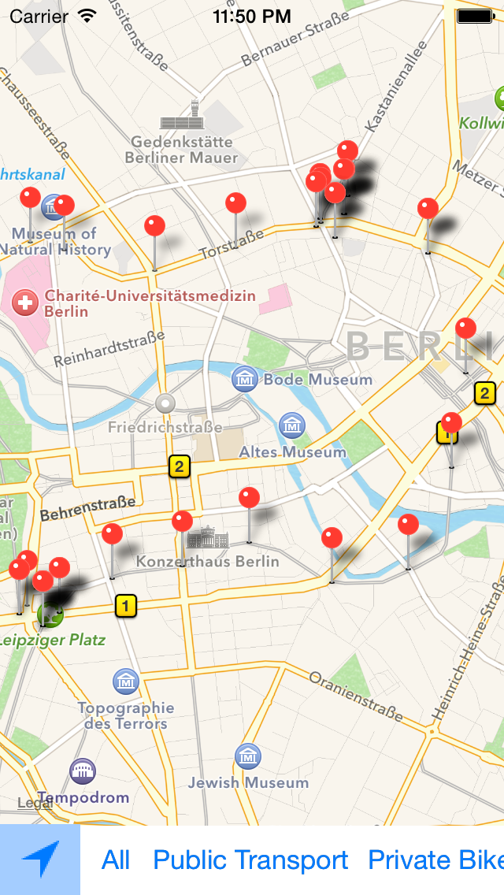
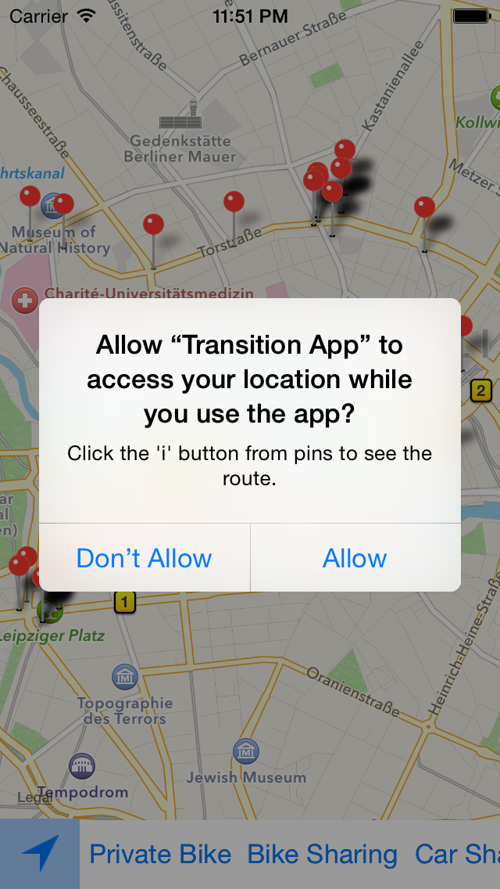
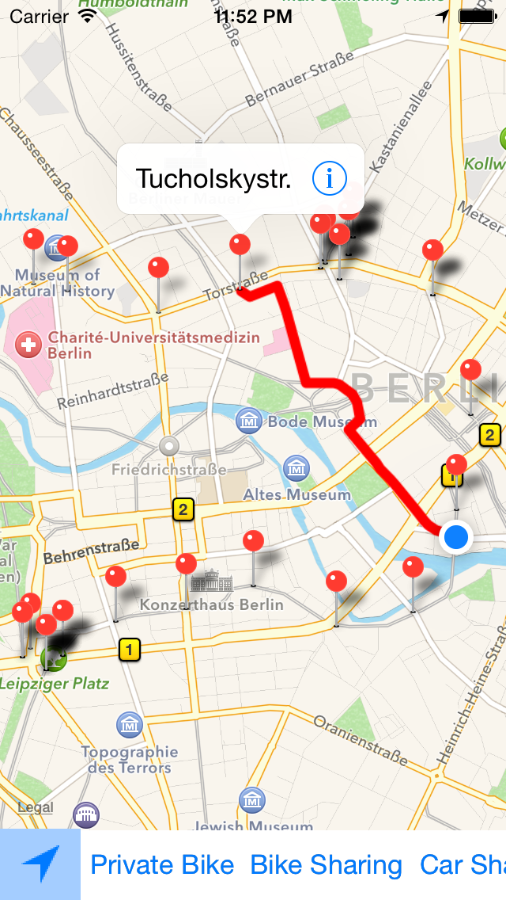
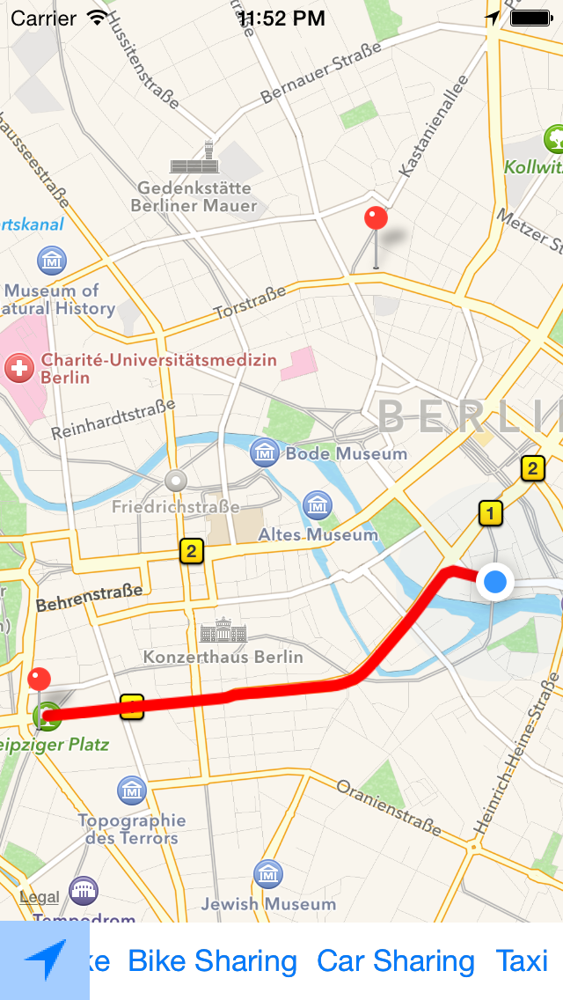

# TransitApp
This is a simplifird version of a transit app. Given the users current location finds a route to the specified stop, taken from JSON data.

Used NYT's Objective-C style guide
Autolayout implemented for iPhones

##Screenshots
#####Each pin is a different stop. User can choose what type of transportation is visible.

#####Uses the users currrent location

#####Calculate's route between current location and chosen stop.

#####Showing only 'Taxi' as transportation type.

